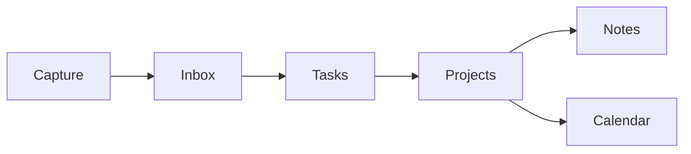

# PlanGlade

[](https://github.com/kalelooz/planglade/actions/workflows/ci.yml) [](./LICENSE)   

PlanGlade is a calm, open-source workspace for capturing, organizing, and
finishing project work.

It is early software for local development, maintainer review, and early
self-hosting work. It is not production-ready yet.

Maintained by kalelooz.


Home - today, inbox, next work, and notes in one calm starting point.

## What It Does

PlanGlade is focused on a small project management loop:

- Capture work quickly.
- Triage Inbox items.
- Turn captured items into Tasks.
- Organize Tasks inside Projects.
- Keep Notes and project context nearby.
- Review due work in Calendar.
- Adjust workspace preferences in Settings.
- Export workspace data.
- Use a guarded import flow.

PlanGlade does not currently promise pricing, hosted cloud, enterprise
reporting, production support, or production uptime.

## Screenshot Gallery

Current screenshots are from a clean local demo workspace.

### Tasks


Tasks - list and planning surface.

### Project Detail


Project detail - project work and notes.

### Calendar


Calendar - due dates from tasks.

## Product Flow



## Current Status

PlanGlade is under active development.

Working today:

- Main app navigation.
- Home command center.
- Inbox capture.
- Inbox triage.
- Tasks list view.
- Tasks board view.
- Project list.
- Project Home.
- Project notes and context.
- Notes editing.
- Markdown notes.
- Task extraction from notes.
- Calendar over task due dates.
- Workspace settings.
- JSON export.
- Guarded JSON import.
- Local development auth mode.
- Server-backed reads and writes.
- Workspace-scoped data foundations.
- Public landing page.
- Getting-started page.

Not ready yet:

- Production-hardening.
- Docker support.
- Generic production deployment docs.
- Public hosted cloud.
- Billing.
- Pricing.
- Admin or team management.
- Production SLA promises.
- Dedicated public security contact.

## Features Available Today

- Home command center.
- Quick capture to Inbox.
- Inbox triage into tasks.
- Tasks with list and board views.
- Projects and Project Home.
- Project notes and context.
- Notes and project context.
- Notes with Markdown editing.
- Calendar over due dates.
- Settings for workspace preferences.
- JSON export and guarded import.

## Roadmap

For more detail, see [ROADMAP.md](./ROADMAP.md).

**Available Today**

- Home.
- Inbox.
- Tasks.
- Projects.
- Notes and project context.
- Calendar.
- Settings.
- JSON export.
- Guarded import.
- Early self-host docs.

**Next**

- Timeline planning view.
- Task dependencies.
- Recurring tasks.
- Stronger self-host path.
- Production documentation cleanup.
- Security hardening.
- Backup and restore polish.

**Later**

- Collaboration surfaces.
- Hosted cloud option.
- Billing.
- Admin/team features.

## Setup

Requirements:

- Node.js 20.9 or newer.
- npm 10 or newer.
- A local `.env` file.
- A local SQLite database path.
- Local attachment storage.

Install dependencies:

```bash
npm install
```

Copy the environment example:

```bash
cp .env.example .env
```

On Windows PowerShell:

```powershell
Copy-Item .env.example .env
```

For local development, use these values in `.env`:

```env
DATABASE_URL="file:../db/custom.db"
PLANGLADE_AUTH_MODE="dev"
NEXT_PUBLIC_PLANGLADE_AUTH_MODE="dev"
PLANGLADE_STORAGE_PROVIDER="local"
PLANGLADE_LOCAL_STORAGE_DIR="storage/local-attachments"
PLANGLADE_STORAGE_SIGNING_SECRET="replace-with-a-random-local-secret"
```

Generate Prisma client and prepare the local database:

```bash
npm run db:generate
npm run db:push
```

Start the dev server:

```bash
npm run dev
```

Open `http://localhost:3000`.

Useful validation commands:

```bash
npm test
npm run lint
npm run typecheck
npm run build
```

## Environment Notes

Start from `.env.example`.

Important local variables:

- `DATABASE_URL`
- `PLANGLADE_AUTH_MODE`
- `NEXT_PUBLIC_PLANGLADE_AUTH_MODE`
- `PLANGLADE_STORAGE_PROVIDER`
- `PLANGLADE_LOCAL_STORAGE_DIR`
- `PLANGLADE_STORAGE_SIGNING_SECRET`

Optional setup areas:

- Firebase auth and storage variables.
- NextAuth provider variables.
- Email invite variables.
- Invite expiry maintenance token.

Do not commit real `.env` files or secrets.

## Docs

- [ROADMAP.md](./ROADMAP.md)
- [CONTRIBUTING.md](./CONTRIBUTING.md)
- [SECURITY.md](./SECURITY.md)
- [CODE_OF_CONDUCT.md](./CODE_OF_CONDUCT.md)
- [docs/SELF_HOSTING.md](./docs/SELF_HOSTING.md)
- [docs/BACKUP_RESTORE.md](./docs/BACKUP_RESTORE.md)

## Community

Contributions should stay small, scoped, and honest about current product
limits.

Avoid adding fake product actions, fake metrics, unsupported surfaces, or
claims that make early software look production-ready.

See [CONTRIBUTING.md](./CONTRIBUTING.md) for contribution guidance.

See [SECURITY.md](./SECURITY.md) for security policy details.

## License

PlanGlade is licensed under AGPL-3.0.

See [LICENSE](./LICENSE).
