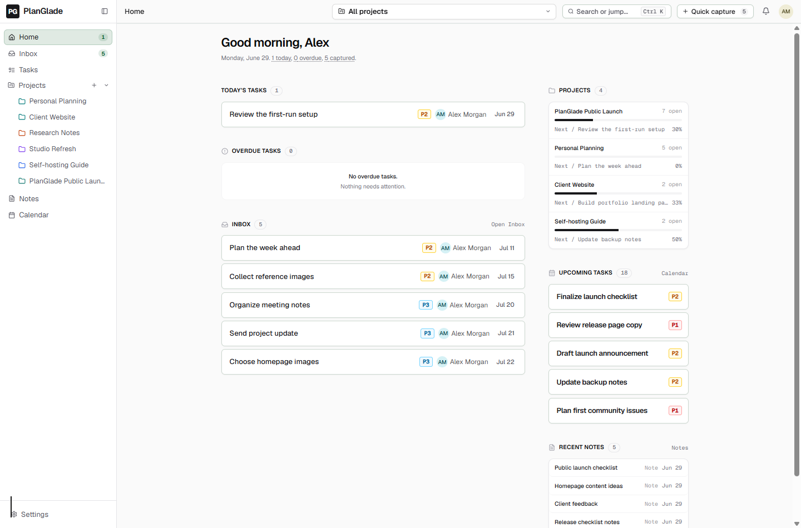
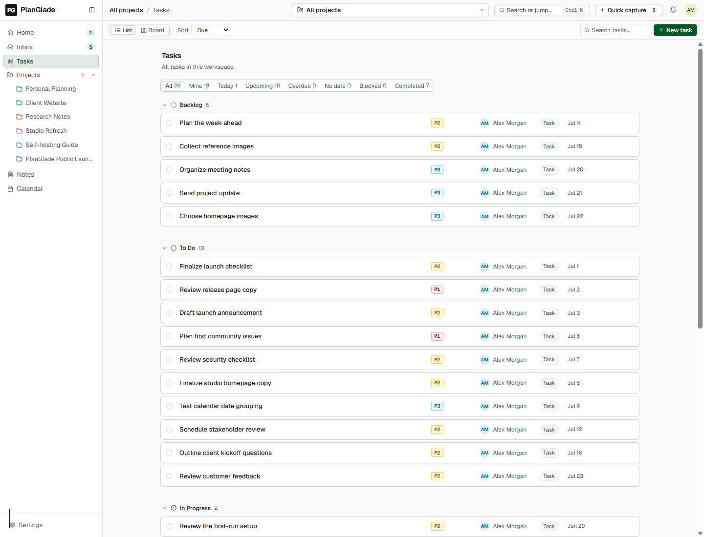
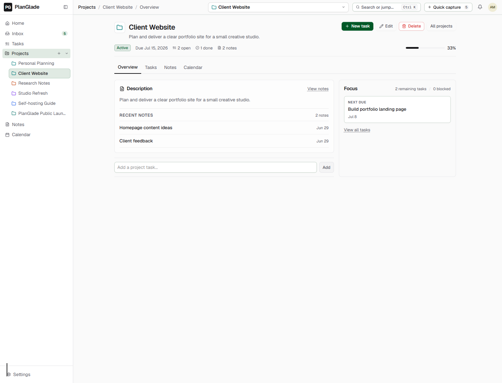
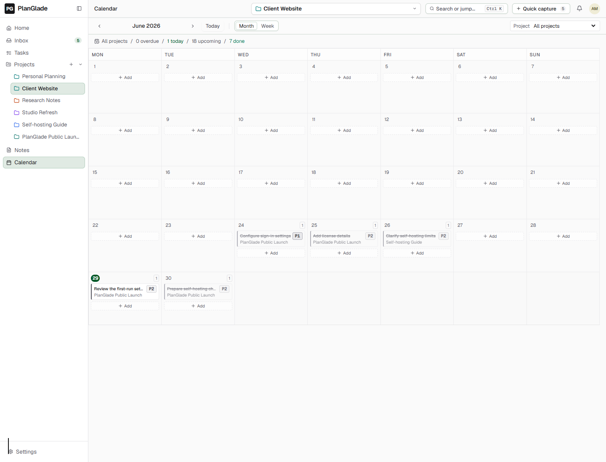
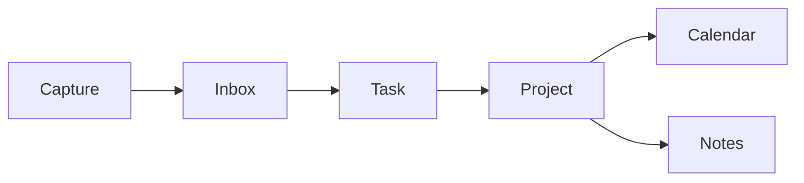
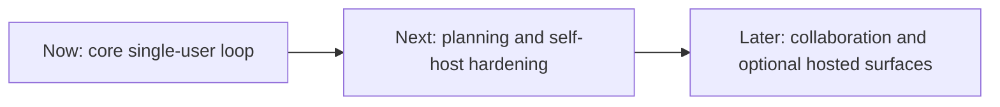
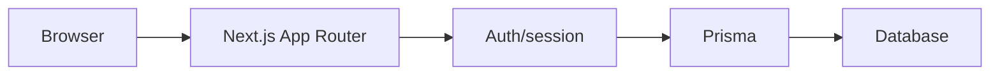

# PlanGlade

[![CI][b-ci]][ci] [![AGPL-3.0][b-license]][license] ![Next.js][b-next] ![TypeScript][b-ts] ![Prisma][b-prisma] ![Self-hosting: early][b-self-hosting]

A calm, open-source workspace for capturing, organizing, and finishing project work.

PlanGlade is early software. It is useful for local development,
maintainer review, and early self-hosting work, but it is not
production-ready yet.

Maintained by kalelooz.



Home - today, inbox, next work, and notes in one calm starting point.

## What You Can Do Today

- Capture work quickly into Inbox.
- Turn inbox items into real tasks.
- Plan in Tasks with list and board views.
- Keep project work, notes, and due dates together.
- Review task due dates in Calendar.
- Export workspace data and use the guarded import flow.
- Run locally with the documented development setup.

No pricing, hosted cloud, AI, enterprise reporting, or production SLA claims
are part of the current public promise.

## Screenshot Gallery

Current screenshots are from a clean local demo workspace.

### Home


Home - today, inbox, next work, notes.

### Tasks



Tasks - list and planning surface.

### Project Detail



Project detail - project work and notes.

### Calendar



Calendar - due dates from tasks.

## Product Flow



## Current Status

Working today:

- Main app navigation: Home, Inbox, Tasks, Projects, Notes, Calendar, and Settings.
- Server-backed reads and writes for the core task/project/note loop.
- Home command center with today, overdue, inbox, project focus, and next-up.
- Inbox capture and triage into real tasks.
- Tasks with list and board views.
- Project list and Project Home with real context, task progress, and linked notes.
- Notes with Markdown editing, project linking, and task extraction.
- Calendar as a view over task due dates.
- Settings with workspace preferences, JSON export, and guarded import.
- Public landing and getting-started pages for explaining the MVP before sign-in.
- Local development auth mode.

Not ready yet:

- A production-hardened generic self-host guide.
- Docker/container deployment.
- A public hosted cloud offering.
- A dedicated public security contact.
- Billing, pricing, admin/team management, or production SLA promises.

## Features Available Today

- Home command center.
- Quick capture to Inbox.
- Inbox triage into tasks.
- Tasks with list and board views.
- Projects and Project Home.
- Project notes and context.
- Notes with Markdown editing and task extraction.
- Calendar over task due dates.
- Settings for workspace preferences, JSON export, and guarded import.

## Roadmap

For more detail, see [ROADMAP.md](./ROADMAP.md).

**Available Today**

- Home, Inbox, Tasks, Projects, Notes, Calendar, and Settings.
- Notes and project context.
- JSON export and guarded import.
- Early self-host docs.

**Next**

- Timeline planning view.
- Task dependencies.
- Recurring tasks.
- Stronger self-host path.
- Docker support after it is implemented and tested.
- Security hardening.

**Later**

- Sharing and collaboration surfaces.
- Hosted cloud option.
- Billing.
- Admin/team features.
- AI assistance only after the core app is trustworthy.



Routes for deferred surfaces may exist in the codebase, but they are gated
and redirect to the app home. They are not part of the public MVP product
face.

## Architecture



| Area | Technology |
|---|---|
| Framework | Next.js 16 App Router |
| Language | TypeScript |
| UI | React 19, shadcn/ui, Radix primitives |
| Styling | Tailwind CSS v4, CSS custom properties |
| Database | Prisma with SQLite in the current tracked schema |
| Auth | Local dev session, Firebase mode, NextAuth mode |
| Icons | Lucide React |
| Tables | TanStack Table |
| Package manager | npm |

## Local Development Setup

Requirements:

- Node.js 20.9 or newer.
- npm 10 or newer.
- A local `.env` file based on `.env.example`.

1. Install dependencies.

```bash
npm install
```

2. Copy the environment example.

```bash
cp .env.example .env
```

On Windows PowerShell:

```powershell
Copy-Item .env.example .env
```

3. For local development without production auth, set these values in `.env`:

```env
DATABASE_URL="file:../db/custom.db"
PLANGLADE_AUTH_MODE="dev"
NEXT_PUBLIC_PLANGLADE_AUTH_MODE="dev"
PLANGLADE_STORAGE_PROVIDER="local"
PLANGLADE_LOCAL_STORAGE_DIR="storage/local-attachments"
PLANGLADE_STORAGE_SIGNING_SECRET="replace-with-a-random-local-secret"
```

4. Generate Prisma client and create/update the local database.

```bash
npm run db:generate
npm run db:push
```

5. Start the dev server.

```bash
npm run dev
```

Open `http://localhost:3000`.

## Environment Variables

Start from `.env.example`.

Important local/dev variables:

- `DATABASE_URL`: SQLite database path for the current tracked schema.
- `PLANGLADE_AUTH_MODE`: use `dev` for local development.
- `NEXT_PUBLIC_PLANGLADE_AUTH_MODE`: match the server auth mode.
- `PLANGLADE_STORAGE_PROVIDER`: use `local` for local file storage.
- `PLANGLADE_LOCAL_STORAGE_DIR`: local attachment folder.
- `PLANGLADE_STORAGE_SIGNING_SECRET`: signing secret for local attachment URLs.

Production-style variables depend on the auth/storage path:

- Firebase auth/storage: `NEXT_PUBLIC_FIREBASE_*`, `FIREBASE_PROJECT_ID`, and Firebase Admin credentials.
- NextAuth provider mode: `NEXTAUTH_SECRET`, `NEXTAUTH_URL`, and provider credentials such as Google or GitHub.
- Email invites: `PLANGLADE_EMAIL_PROVIDER`, `PLANGLADE_EMAIL_FROM`, and `RESEND_API_KEY`.
- Invite expiry job: `PLANGLADE_MAINTENANCE_TOKEN`.

Do not commit real `.env` files or secrets.

## Database And Setup Notes

The tracked Prisma schema currently uses SQLite:

```env
DATABASE_URL="file:../db/custom.db"
```

Use `npm run db:push` for local development setup.

`npm run db:reset` exists, but it is destructive. Use it only on an
isolated local database when you intentionally want to reset data.

## Self-Hosting Status

PlanGlade has an early local/developer self-host path. It is not production-ready yet.

Current honest status:

- Local development with SQLite and local file storage is documented above.
- `/api/health` reports basic auth/storage readiness.
- Basic manual backup/restore notes exist in `docs/BACKUP_RESTORE.md`.
- Firebase App Hosting notes exist in `docs/DEPLOYMENT_FIREBASE_APP_HOSTING.md`; they are not a final production guide.
- Docker is not supported by this repo today.
- A production database/storage/auth guide still needs a follow-up ticket.

See `docs/SELF_HOSTING.md` for the current self-hosting notes and limitations.

Backup and restore notes are in `docs/BACKUP_RESTORE.md`.

## Useful Commands

```bash
npm run dev
npm run db:generate
npm run db:push
npx prisma validate
npm test
npm run lint
npm run typecheck
npm run build
```

Notes:

- `npm run build` validates auth config before building.
- `npm run start` expects the standalone build output from `npm run build`.
- Full lint/typecheck/build can take longer for non-doc changes.

## Contributing, Security, And License

PlanGlade is licensed under AGPL-3.0. See [LICENSE](./LICENSE).

See [CONTRIBUTING.md](./CONTRIBUTING.md), [SECURITY.md](./SECURITY.md), and [CODE_OF_CONDUCT.md](./CODE_OF_CONDUCT.md).

The repo is still pre-public-launch and not production-hardened. Keep
contributions small, scoped, and honest about current product limits.

## Documentation Map

- `docs/SELF_HOSTING.md`: current self-hosting status and setup notes.
- `docs/BACKUP_RESTORE.md`: basic manual backup/restore notes for the current local SQLite path.
- `docs/DEPLOYMENT_FIREBASE_APP_HOSTING.md`: Firebase App Hosting notes, not a final generic production guide.
- `docs/QUALITY-GATES.md`: validation expectations for repo work.

[ci]: https://github.com/kalelooz/planglade/actions/workflows/ci.yml
[license]: ./LICENSE
[b-ci]: https://github.com/kalelooz/planglade/actions/workflows/ci.yml/badge.svg
[b-license]: https://img.shields.io/badge/license-AGPL--3.0-blue.svg
[b-next]: https://img.shields.io/badge/Next.js-16-black
[b-ts]: https://img.shields.io/badge/TypeScript-5-blue
[b-prisma]: https://img.shields.io/badge/Prisma-6-2D3748
[b-self-hosting]: https://img.shields.io/badge/self--hosting-early-yellow
