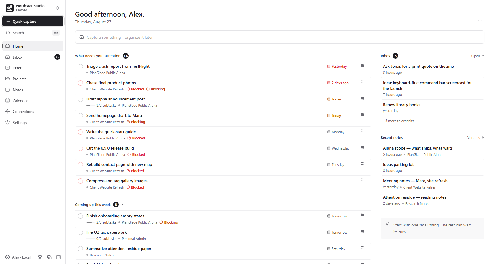
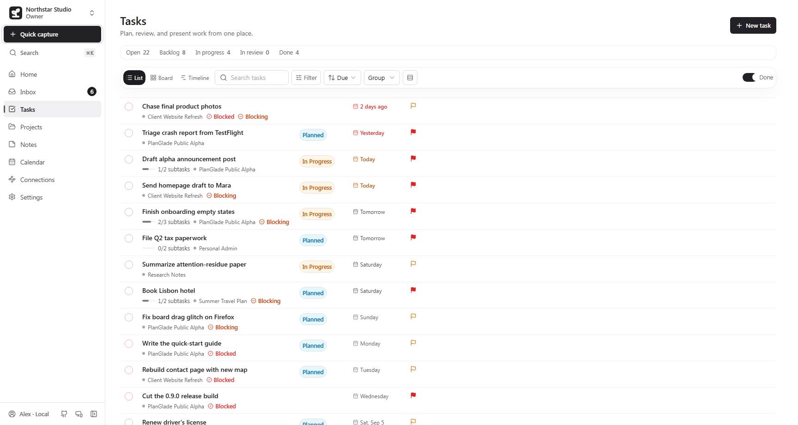
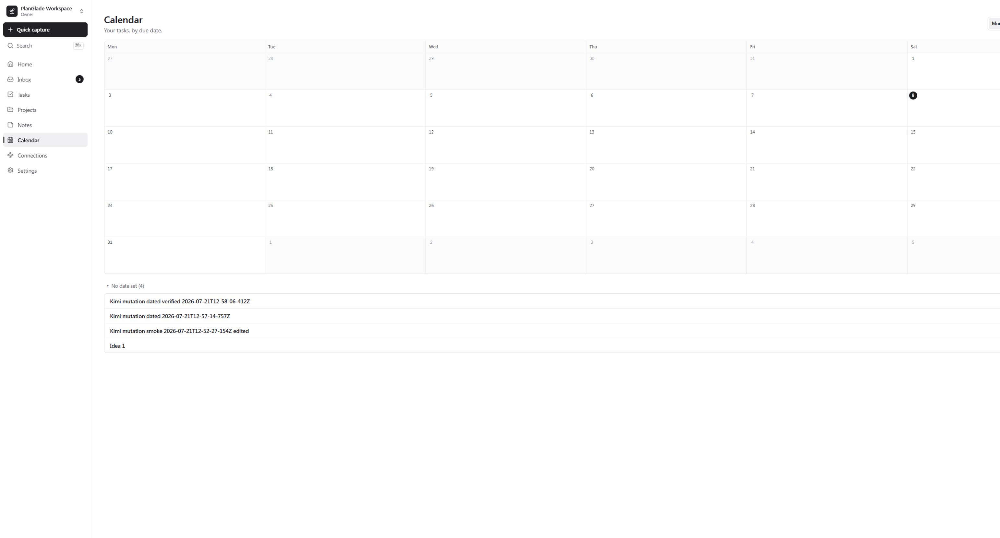
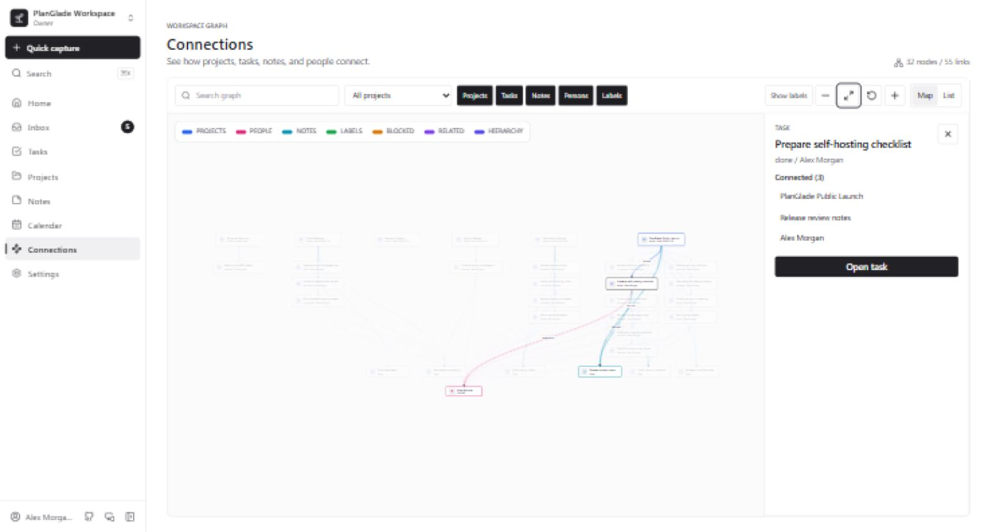

<p align="center">
  
</p>

<h1 align="center">PlanGlade</h1>

<p align="center">
  A calm, self-hosted workspace for tasks, projects, notes, schedules, and the connections between them.
</p>

<p align="center">
  <a href="./docs/USER_GUIDE.md">User guide</a> ·
  <a href="./backend/docs/SELF_HOSTING.md">Self-hosting</a> ·
  <a href="./CONTRIBUTING.md">Contributing</a> ·
  <a href="./CHANGELOG.md">Changelog</a> ·
  <a href="./SECURITY.md">Security</a>
</p>

<p align="center">
  <a href="./docs/images/home.png">
    
  </a>
</p>

PlanGlade keeps planning direct: capture work quickly, organize it when you are ready, and move between list, board, timeline, calendar, and relationship views without duplicating tasks.

## What you can do

- Capture tasks without leaving your current page.
- Triage incoming work in a dedicated inbox.
- Plan tasks in list, board, timeline, and calendar views.
- Organize work into projects with notes and supporting context.
- Explore relationships between projects, tasks, notes, people, and labels.
- Export workspace data and preview guarded imports.
- Run the complete application on your own infrastructure with SQLite and local attachment storage.

## A closer look

Select any image to open the full-resolution view.

<table>
  <tr>
    <td width="50%">
      <a href="./docs/images/tasks.png"></a>
      <br><strong>Tasks</strong><br><sub>Filter, group, schedule, and review work from one place.</sub>
    </td>
    <td width="50%">
      <a href="./docs/images/calendar.png"></a>
      <br><strong>Calendar</strong><br><sub>See deadlines and busy days without losing task detail.</sub>
    </td>
  </tr>
  <tr>
    <td colspan="2">
      <a href="./docs/images/connections.png"></a>
      <br><strong>Connections</strong><br><sub>Trace dependencies and relationships across the workspace.</sub>
    </td>
  </tr>
</table>

## Run PlanGlade

### Docker

Copy the environment template and replace every placeholder before exposing the app:

```bash
cp .env.example .env
docker compose -f compose.yml config
docker compose -f compose.yml build
docker compose -f compose.yml up -d
```

Open `http://localhost:8080`. Health endpoints are available at `/healthz` and `/api/health`.

For an internet-facing installation, set `PLANGLADE_PUBLIC_URL` to the final HTTPS origin, configure the matching Google callback at `/api/auth/callback/google`, terminate TLS in front of the app, and back up both Docker volumes. Read the [self-hosting guide](./backend/docs/SELF_HOSTING.md) before exposing an installation publicly.

### Local development

```bash
npm run install:all
cp backend/.env.example backend/.env
npm run dev --prefix frontend
```

The frontend runs at `http://127.0.0.1:5173`; the backend API runs on port `3000`.

## Architecture

PlanGlade keeps the product in one repository while separating its runtime responsibilities:

```text
planglade/
├── frontend/    React and Vite product interface
├── backend/     API, authentication, SQLite, migrations, and attachments
├── compose.yml  Single-origin production deployment
└── docs/        User-facing project documentation
```

Docker Compose exposes one application origin on port `8080`; API, authentication, and setup requests are routed to the backend internally.

## Documentation

- [User guide](./docs/USER_GUIDE.md)
- [Self-hosting](./backend/docs/SELF_HOSTING.md)
- [Backup and restore](./backend/docs/BACKUP_RESTORE.md)
- [Production migrations](./backend/docs/PRODUCTION_MIGRATIONS.md)
- [Contributing](./CONTRIBUTING.md)
- [Security policy](./SECURITY.md)
- [Changelog](./CHANGELOG.md)

## Verify a checkout

```bash
npm run check:public
npm run lint
npm run typecheck
npm test
npm run build
```

## Community and support

- Found a bug? [Open a GitHub issue](https://github.com/kalelooz/planglade/issues/new).
- Want to improve PlanGlade? Read the [contributing guide](./CONTRIBUTING.md).
- Found a security issue? Follow the private reporting process in the [security policy](./SECURITY.md).

## License

PlanGlade is available under the [GNU Affero General Public License v3.0](./LICENSE).
