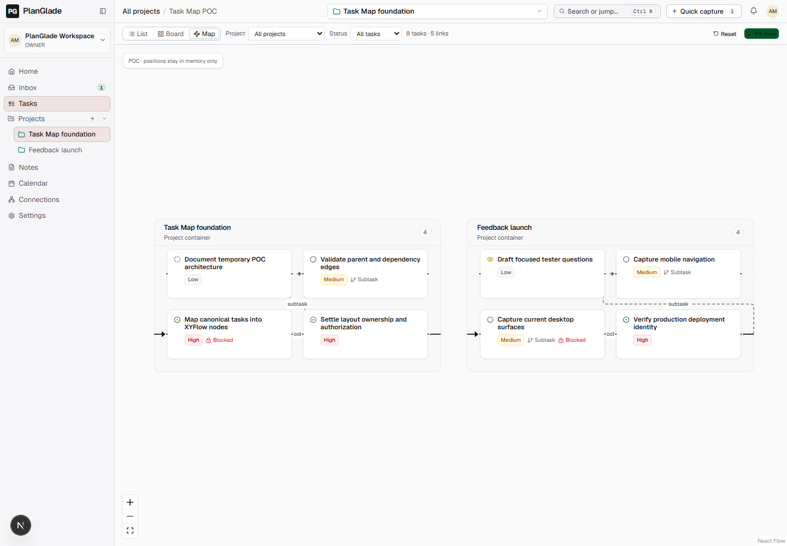
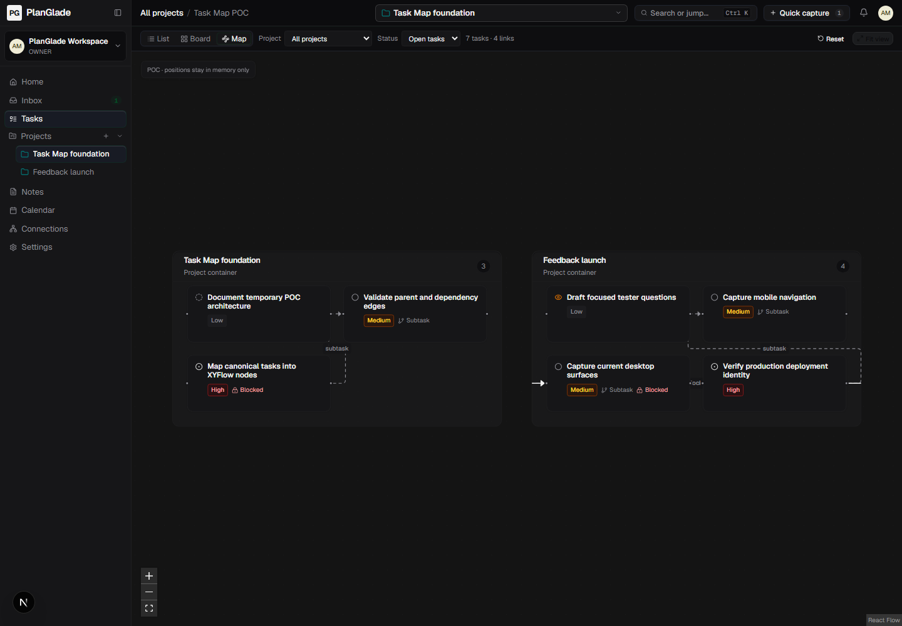
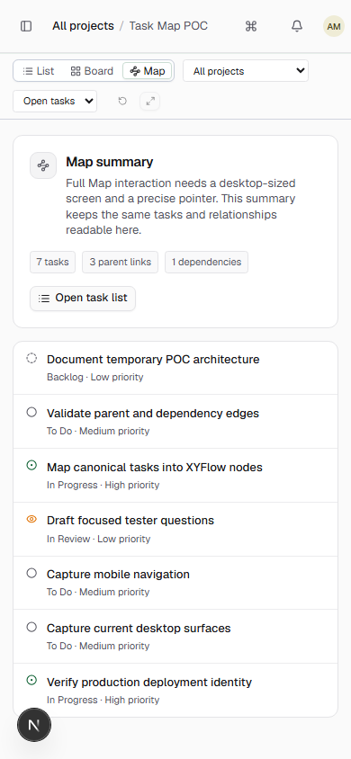

# XYFlow Task Map proof of concept

Status: isolated draft proof only. Do not merge or treat this as production Map architecture.

## What this proves

- `@xyflow/react` works with the current Next.js, React, theme, and task-page stack.
- The existing authenticated task and project responses can render project containers, task nodes, parent/subtask edges, and dependency edges without creating another source of task truth.
- Pan, zoom, fit, task selection, local drag, keyboard selection/movement, project/status filters, light/dark themes, and a narrow-screen summary can fit PlanGlade's current shell.
- The Map code is lazy-loaded and is absent from `/demo`.
- Connections remains unchanged and still loads independently.

## Temporary architecture

- Entry: `/app/tasks?view=map`, with optional existing `project` query scope.
- Data: the same project and work-item responses already loaded by Tasks.
- Layout: deterministic client layout; dragged positions remain only in React memory and reset on reload or filter change.
- Editing: read-only task inspector. No task, project, status, hierarchy, or relationship mutation.
- Storage: no schema, migration, Map API, or persistent coordinates.
- Guardrails: progressive off-screen rendering above 250 matching tasks, canvas refusal above 500 tasks, and a summary/list fallback below 1024px or without a fine pointer.

## What must change before production

- Land the reviewed shared-layout and per-user-preference schema, workspace/project scope keys, revision conflicts, authorization, deletion behavior, and portable import/export support.
- Reuse hardened domain services for hierarchy, relationships, and confirmed project moves; do not make the canvas authoritative.
- Add save/retry/conflict states, an authoritative text relationship workflow, complete keyboard editing, and production cap/stress tests.
- Verify migrations, workspace isolation, role boundaries, export/import round trips, browser accessibility, and production deployment before enabling Map outside a draft branch.

## Evidence

Desktop, light theme:

Desktop, dark theme:

Narrow-screen fallback:

The focused model tests cover canonical task IDs, project grouping, hierarchy/dependency edges, filters, and the hard rendering cap. Local browser verification also checked that dragging and keyboard movement do not alter task truth, Connections still loads, and the browser console remains clear.

## Recommendation

Proceed with XYFlow as the rendering foundation, but revise this proof into the accepted persistence and authorization contract through separate production tickets. Keep this PR draft and do not merge the temporary in-memory implementation.
