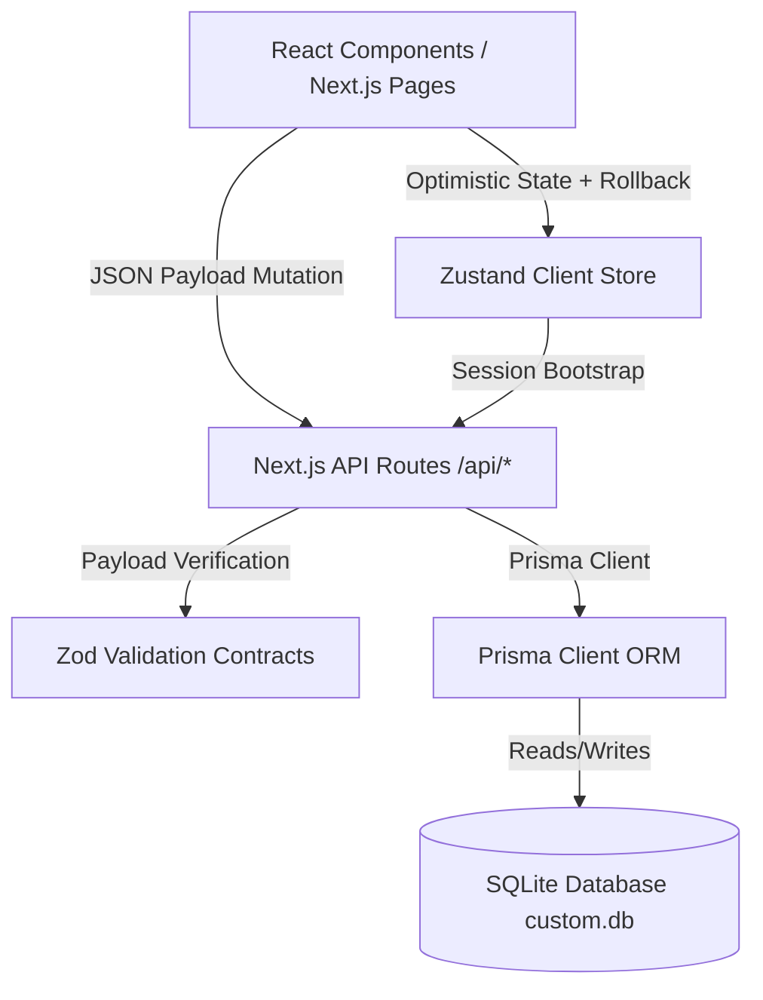
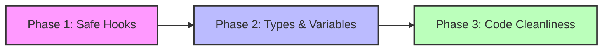

# FlowBoard Systematic Engineering & Architecture Audit

> **Audit Date:** May 20, 2026  
> **Target Path:** `c:\Projects\Project Managment`  
> **Status:** Phase 1 (Foundation) & Phase 2 (Server-backed Core Loop) Rewires Complete

---

## 1. Executive Summary

FlowBoard has undergone a significant transformation from a polished, local-first frontend prototype into a robust, full-stack Next.js web application. Key accomplishments since the last audit cycle include:
- **Clean TypeScript Compilation:** All typescript compile-ignore blocks (`typescript.ignoreBuildErrors`) have been removed from `next.config.ts`, and the codebase compiles with **zero errors** under strict checking (`tsc --noEmit`).
- **Complete Server-Backed Loop:** Critical application surfaces (Home, My Tasks, Projects, Notes, Calendar, Timeline, Inbox) have been successfully rewired from mock-data arrays and `localStorage` syncing to a persistent SQLite database through a server-side Prisma ORM integration.
- **Robust Feature Integrity:** Complex client-side behaviors—like debounced auto-saving (350ms) in notes and markdown-based task checklist extraction—now communicate directly with transactional backend endpoints (`/api/work-items` and `/api/notes`).

However, as the codebase approaches production-grade deployment readiness, three key risks require attention:
1. **Permissive Lint Rules:** The current ESLint configuration (`eslint.config.mjs`) has bypassed almost all standard checks (e.g. `no-unused-vars`, `@typescript-eslint/no-explicit-any`, `prefer-const`). While this accelerated rapid prototyping, it exposes the application to code safety and performance hazards.
2. **Windows Filesystem Caching Locks:** Standard Next.js development server executions using Turbopack on default ports (e.g. `npm run dev`) trigger database and build cache locks under Windows. Running on port `3002` with Webpack solves these filesystem collisions.
3. **Scaffolded Security Boundaries:** Server sessions are dynamically resolved via a scaffolded dev route (`/api/auth/session`) which defaults to a mock workspace actor. Production hardening requires full OAuth adapter implementation and multi-tenant authorization guards.

---

## 2. Architecture & Data Flow Assessment

### Core Tech Stack Mapping

The full-stack schema is cleanly divided between client-side state handling and database transactions:



### Data Model Integrity (`prisma/schema.prisma`)

The Prisma schema is highly mature and represents a production-grade multi-tenant model.
- **Multi-Tenancy:** Driven by `Workspace` and `WorkspaceMember` models. The intermediate relation guarantees robust scoping, allowing multiple users to belong to multiple workspaces with distinct `WorkspaceRole` privileges (`OWNER`, `ADMIN`, `MEMBER`, `VIEWER`).
- **Relational Integrity:**
  - `WorkItem` represents the central task model. It links to `Project` (optional), `User` (as creator and assignee), and features self-referential relations (`parentId` / `children`) to model task hierarchies.
  - Checklists and Note references are stored as `Json` formats within `WorkItem`, preserving flexibility without requiring excessively complex relational tables for minor text elements.
  - Explicit `WorkItemRelation` and `WorkItemLabel` join tables represent robust bidirectional link records (e.g. `BLOCKS`, `BLOCKED_BY`, `PARENT_OF`, `CHILD_OF`).
- **Audit Trails:** Supported by `ActivityEvent` and `Comment` tables linked directly to workspaces and actors.

### Data Contract Layer (`src/lib/contracts.ts`)

The contract layer employs `Zod` schemas to cleanly map incoming request shapes to the Prisma context.
- **Input Validation:** Key mutation targets (e.g. `createWorkItemSchema`, `updateWorkItemSchema`, `createProjectSchema`) have dedicated schemas ensuring type-safe boundary parsing.
- **Import Scaffolding:** `importLocalWorkspaceSchema` allows clean migration from old frontend mock formats by parsing local arrays (`projects`, `workItems`, `notes`) and feeding them safely into the database transaction layer.

---

## 3. Quality Gate Conformance & Status

An evaluation of the codebase against `docs/QUALITY-GATES.md` reveals outstanding progress, alongside a few outstanding actions:

| Gate Criterion | Status | Assessment / Details |
|---|---|---|
| **TypeScript Build Errors** | **PASS** | Strict TypeScript check (`node node_modules\typescript\bin\tsc --noEmit`) returns **0 errors**. No bypass options remain in `next.config.ts`. |
| **Cross-Platform Scripts** | **PASS** | Bun-only script targets have been replaced. Production standalone executions run cleanly under node: `node .next/standalone/server.js`. |
| **Fake UI Controls** | **PASS** | Empty or non-functional buttons have been either disabled, routed to valid backend APIs, or safely hidden behind the `Advanced` menu. |
| **Multi-Tenant Scoping** | **PASS** | Workspace security bounds (`workspaceId` query parameters) are strictly checked and enforced on all API route updates/deletions. |
| **Loose ESLint Rules** | **FAIL** | Eslint rules are almost completely disabled in `eslint.config.mjs`, representing a critical gate bypass before shipping code. |

---

## 4. ESLint Configuration Hazard Audit

The configuration file `eslint.config.mjs` has been audited. The current setup overrides and disables critical JavaScript, TypeScript, and React compilation safety guards:

### Dangerous Rule Disables & Risks

1. **`no-unused-vars` and `@typescript-eslint/no-unused-vars` ("off")**
   - **Risk:** Allows developers to commit dead imports, unresolved parameters, and obsolete variables. This pollutes the codebase and can hide critical logic errors where a modified variable is never read.
2. **`@typescript-eslint/no-explicit-any` ("off")**
   - **Risk:** Bypasses compile-time type verification. Using `any` spreads type unsafety downstream, turning typescript back into plain javascript and exposing code to runtime `undefined` properties.
3. **`react-hooks/exhaustive-deps` ("off")**
   - **Risk:** React effects (`useEffect`, `useMemo`, `useCallback`) are allowed to run without declared dependency arrays. This is the primary driver of infinite re-render loops, stale UI closures, and memory leaks.
4. **`prefer-const` ("off")**
   - **Risk:** Allows variables declared with `let` to never be reassigned. This reduces code readability and prevents V8 engine optimizations that rely on constant references.
5. **`no-undef` ("off")**
   - **Risk:** Permits referencing variables that are not declared anywhere. Under Next.js dynamic routing, this can lead to compile-time reference failures on production builds.

### Hardening Recommendation Roadmap

To transition FlowBoard to a strict quality gate, the following phased approach is recommended:



* **Phase 1: Safe Hooks (Immediate)**
  * Re-enable `"react-hooks/exhaustive-deps": "warn"`.
  * Fix stale dependencies inside client component hooks to prevent unexpected infinite loops.
* **Phase 2: Types & Variables (Medium Term)**
  * Enable `"no-unused-vars": "warn"` and `"@typescript-eslint/no-unused-vars": "warn"`.
  * Enable `"prefer-const": "warn"`.
* **Phase 3: Clean Boundaries (Production Gates)**
  * Convert warnings into errors (`"error"`) inside CI workflows.
  * Enforce strict type annotations by disabling `no-explicit-any`.

---

## 5. Dev Server & Windows Filesystem Hardening

### Caching Locks under Turbopack
Running standard built-in scripts using `next dev --turbo` on port `3000` under Windows environments often triggers filesystem access locks:
* **The Problem:** The Next.js Turbopack compiler creates intensive file watch handles in the `.next/` cache folder. In Windows, these handles lock the underlying SQLite database file `db/custom.db` or transaction journals if they reside in the same project root.
* **Symptoms:** Next.js throws cache persistence failures:
  ```text
  Persisting failed: Unable to write SST file: The process cannot access the file because it is being used by another process.
  ```
* **The Solution:** The server manager and persistent configurations successfully mitigate this by:
  1. Defaulting the active development environment to **port 3002**.
  2. Bypassing Turbopack watcher locks by leveraging Webpack's standard incremental compiler configuration (`next dev` without the `--turbo` flag).

### Command-Line Execution Under PowerShell
Windows execution policies can block default local command run paths (such as `npx.ps1`). 
* **Safe CLI Practices:** AI agents and developers should avoid wrapping calls in shell script executors if they trigger digital signature errors. Always invoke node-based tools directly:
  ```powershell
  # Instead of npx tsc, call typescript directly via node modules
  node node_modules\typescript\bin\tsc --noEmit
  ```

---

## 6. Key Recommendations & Next Steps

To complete the journey from the full-stack foundation to a secure collaboration MVP (Phase 3), we recommend targeting the following key milestones:

### 1. Multi-Tenant Authorization Security
* **Current State:** API routes extract `x-flowboard-user-id` from requests and query the database via scoped filters. However, deep nested relationships (e.g. fetching labels or note attachments) do not fully verify whether the actor has access to that specific parent workspace.
* **Hardening:** Implement an API middleware layer or custom database client extensions that intercept Prisma queries and automatically inject workspace scope constraints:
  ```typescript
  // Example Prisma middleware boundary:
  prisma.$use(async (params, next) => {
    // Automatically assert workspace permissions
    return next(params)
  })
  ```

### 2. Transition from Dev-Scaffold to Production OAuth
* **Current State:** Server sessions resolve dynamically via `getServerSession` pointing to `/api/auth/session`.
* **Hardening:** Configure a production identity provider (like GitHub or Google OAuth) in `.env` using the modular options defined in `src/lib/auth-options.ts`. Turn on `FLOWBOARD_AUTH_MODE=nextauth` in production configurations to swap out the dev scaffold safely.

### 3. Server-Derived Activity Logs
* **Current State:** Activity histories are generated client-side by mutating localized arrays in Zustand.
* **Hardening:** Hook the transaction database operations inside `POST`/`PATCH`/`DELETE` API endpoints to insert real `ActivityEvent` rows upon successful database mutations. This ensures activity history is unified across all collaborators.

### 4. Durable Attachment Providers
* **Current State:** `Attachment` rows exist in the database, but physical file storage is scaffolded.
* **Hardening:** Implement a local file upload route (`/api/attachments`) for development storing files under the `upload/` directory, and wire up an S3/compatible object storage client for production setups.
